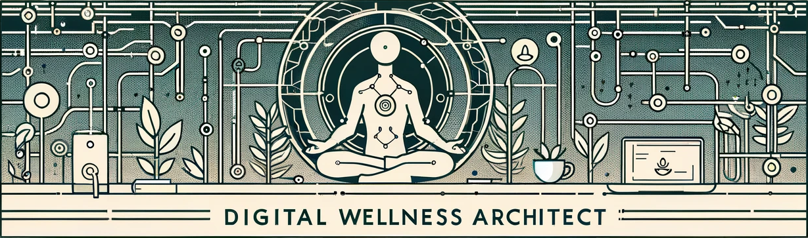

<h1 align="center"> Welcome to my GitHub! 🌱</h1>

  &nbsp;&nbsp;
  &nbsp;&nbsp;

---

<h1 align="center">Who Am I?</h1>

Hi, I'm Isai Chaidez, a Digital Wellness Architect based in Seattle, WA. My academic foundation in Ayurvedic Sciences and Herbal Sciences has seamlessly transitioned into a passion for software development. I specialize in blending the serenity of yoga and meditation with the dynamic world of technology. My goal is to intertwine these diverse realms, creating digital solutions that promote wellness and balanced living.

My work is centered on developing innovative tools that bridge traditional health wisdom with contemporary technology, prioritizing user-friendly applications for holistic health. As a lifelong learner, I'm constantly exploring new technologies to enhance my skill set. My mission is to contribute to a healthier, more connected world through the thoughtful application of technology. Join me in this exciting journey, where the tranquility of ancient practices meets the vibrancy of modern innovation.

